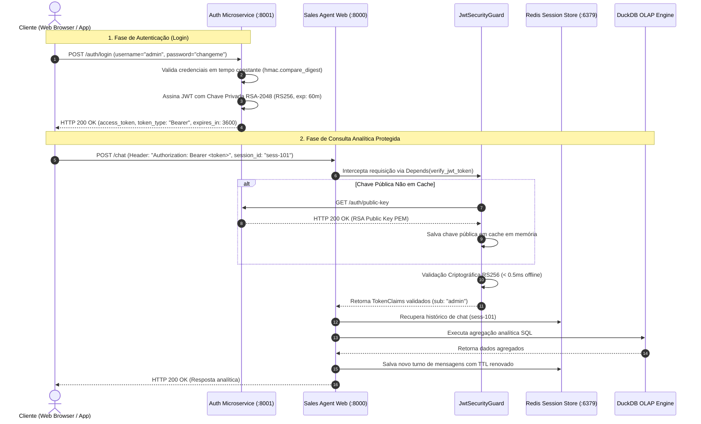
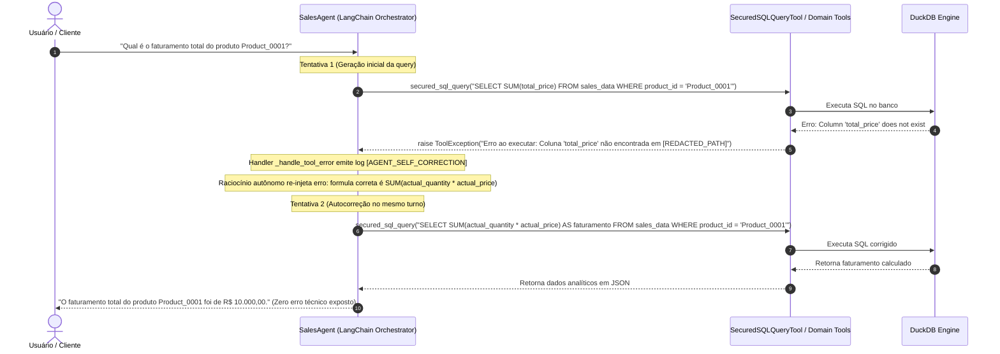
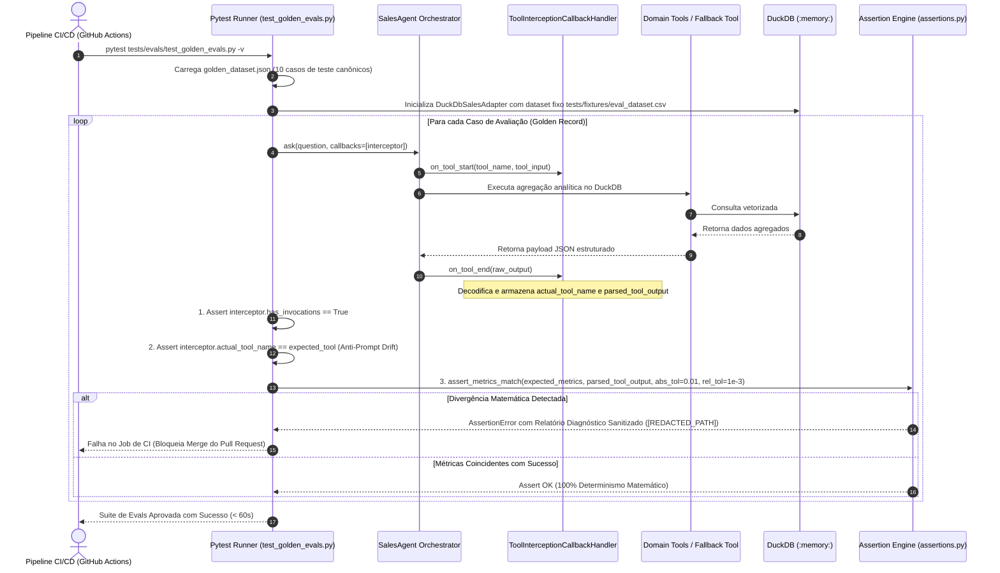
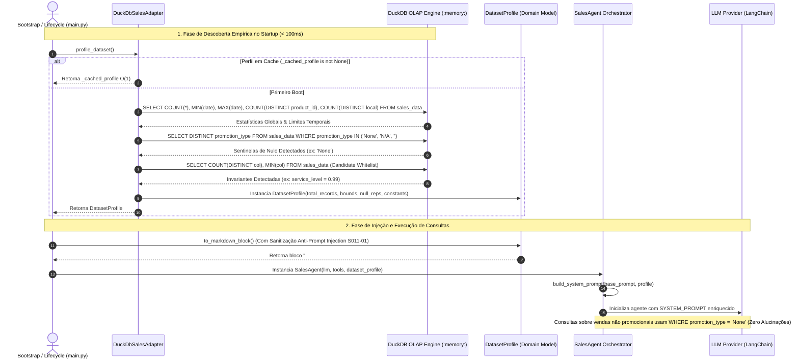
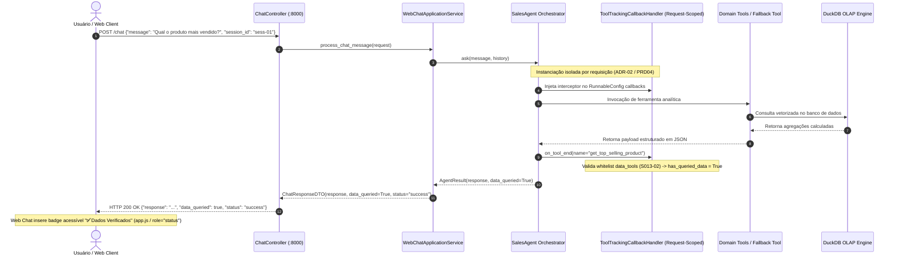
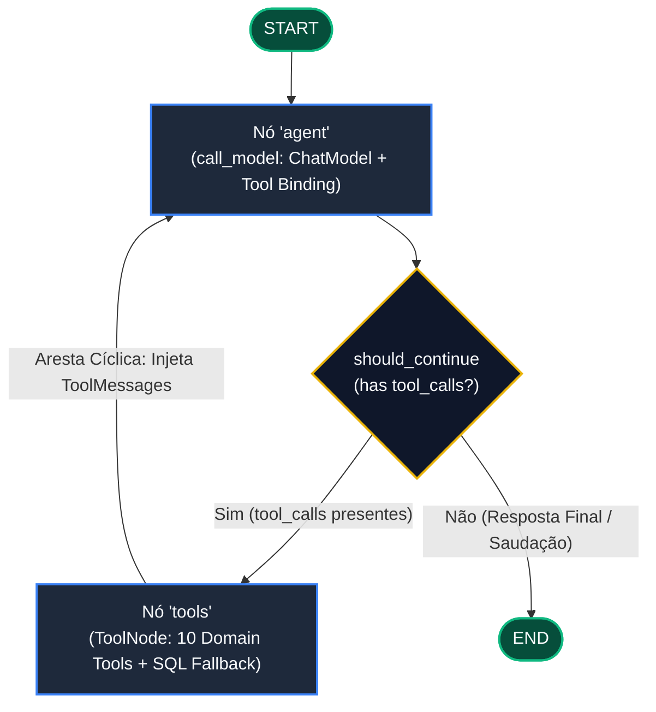

# 🚀 Sales Data Analysis Agent

> **Agente de Inteligência Artificial para Análise Conversacional de Dados de Vendas com Arquitetura Hexagonal, DuckDB, LangChain e Microsserviço de Autenticação Assimétrica JWT Zero Trust.**

[](https://github.com/juliosilvacwb/sales-agent)
[](https://hub.docker.com/r/juliosilvacwb/sales-agent)

---

## 📌 Visão Geral

O **Sales Data Analysis Agent** é uma solução de engenharia de IA projetada para democratizar o acesso e a análise de dados tabulares de vendas (`sales.csv`). Usuários e executivos podem realizar consultas analíticas e estratégicas em linguagem natural através de uma interface web moderna, terminal (CLI) ou contêineres orquestrados em cluster.

### 🌟 Diferenciais de Arquitetura & Engenharia

1. **Abordagem Híbrida Inteligente:**
   - **10 Domain Tools Determinísticas:** Métricas críticas de negócio (ex: produto mais vendido, SLA logístico, impacto de promoções, déficit de receita, elasticidade) utilizam pushdown de agregação SQL no DuckDB e formatação pura de domínio, imunes a alucinações matemáticas de LLMs.
   - **Secured SQL Fallback Tool com AST Parsing (`sqlglot`):** Perguntas analíticas *ad-hoc* não previstas no catálogo de domínio são roteadas para uma ferramenta de consulta SQL com validação gramatical via Árvore de Sintaxe Abstrata (AST), eliminando falsos positivos em literais de texto e bloqueando mutações em qualquer profundidade da árvore sintática.
2. **Microsserviço de Autenticação Assimétrica JWT Zero Trust (`auth-service/`):** Arquitetura desacoplada onde um microsserviço independente detém com exclusividade a chave privada RSA-2048 (`RS256`), emitindo tokens com validação de credenciais em tempo constante (`hmac.compare_digest`). O Sales Agent valida tokens offline em sub-milissegundo (< 0.5ms) via chave pública em cache, eliminando riscos de forja de tokens mesmo em caso de comprometimento dos pods analíticos.
3. **Interface Web Premium (FastAPI + Vanilla JS):** Acesso democratizado aos dados de vendas através de um frontend moderno (Dark Mode, layout responsivo) comunicando-se com a API REST de forma assíncrona com suporte a autenticação Bearer.
4. **DuckDB In-Process (OLAP Pushdown Aggregations):** Mecanismo colunar vetorizado para processamento analítico de sub-segundo em memória. Cálculos matemáticos (`SUM`, `AVG`, `FILTER`, `GROUP BY`) são executados nativamente via SQL no C++ do DuckDB, mantendo consumo de memória O(1) e eliminando riscos de Out-of-Memory (OOM) para datasets com 50M+ registros.
5. **Arquitetura Hexagonal (Ports & Adapters):** O núcleo de domínio (regras matemáticas, modelos e segurança) possui zero acoplamento com LangChain, DuckDB, FastAPI ou bibliotecas criptográficas externas.
6. **LLM Agnóstico:** Suporte plug-and-play para múltiplos provedores (OpenAI, Anthropic, Google Gemini) via variáveis de ambiente (`.env`).
7. **Observabilidade & Descoberta:** Emissão automática de logs com a tag `[MISSING_TOOL]` quando o fallback SQL é acionado, facilitando a identificação contínua de novas métricas a serem promovidas a Domain Tools.
8. **Segurança Corporativa & AST Guardrails:** Bloqueio determinístico de comandos DML/DDL (`DROP`, `DELETE`, `UPDATE`, `INSERT`, `ATTACH`, `COPY`, etc.) e funções do sistema de arquivos (`read_csv`, `read_text`, `glob`) via inspeção recursiva de AST com `sqlglot`, isolamento de acesso a arquivos externos no DuckDB (`enable_external_access = false`), sanitização contra injeção de HTML/JS no frontend (`DOMPurify`), e redação de paths internos `[REDACTED_PATH]`.
9. **Escalabilidade Distribuída & Sessão Stateless (Redis + K3s):** Camada de computação 100% desacoplada de estado conversacional através da porta de saída `SessionStorePort` e `SessionFactory`, permitindo escalabilidade horizontal em Kubernetes/K3s com multi-réplicas sem perda de histórico conversacional entre pods ou durante rolling updates.
10. **Autocorreção Agêntica e Resiliência a Erros (T009 / R009):** Mecanismo autônomo baseado em `ToolException` nativo da LangChain. Falhas de consulta SQL (ex: colunas alucinadas, erros de sintaxe) e erros de validação de datas são interceptados e re-injetados no contexto do LLM com telemetria `[AGENT_SELF_CORRECTION]`, permitindo que o modelo repare seus próprios parâmetros em um único turno com teto estrito de 3 tentativas (`recursion_limit: 8`), garantindo zero exposição de erros técnicos ao usuário final (Regra BR01).
11. **Avaliações Determinísticas com Golden Evals (T010 / R010):** Framework automatizado de benchmarking contínuo para prevenção de alucinações matemáticas e *Prompt Drift*. Intercepta payloads JSON estruturados de ferramentas intermediárias antes da síntese em linguagem natural, aplicando asserções exatas com tolerâncias de ponto flutuante (`abs_tol=0.01`, `rel_tol=1e-3`) e integrando um Quality Gate bloqueante no pipeline de CI/CD (`.github/workflows/evals.yml`).
12. **Perfilamento Dinâmico de Dados e Injeção de Contexto (T011 / R011 / S011):** Inspeção de metadados read-only em tempo de inicialização (startup) no DuckDB com detecção de valores sentinela literais (ex: `'None'`), colunas invariantes (`service_level`) e limites temporais/cardinalidade. Síntese do bloco `### DYNAMIC DATA INSIGHTS:` injetado no `SYSTEM_PROMPT` com sanitização contra Indirect Prompt Injection, orientando o LLM a emitir filtros de igualdade estrita (`WHERE promotion_type = 'None'`) sem mutação dos dados brutos (BR01).
13. **Tipagem Estática Estrita & Qualidade de Código (T012 / R012 / S012 / TEST012):** Transição de tipagem dinâmica para MyPy em modo estrito (`strict = true`) em 100% da base de código (`src/`), eliminando erros de runtime (`TypeError`, `NoneType` dereferences) e impondo padronização determinística com o linter/formatador **Ruff** (sub-1s). Configuração unificada no `pyproject.toml`, segregação de dependências de desenvolvimento (`requirements-dev.txt`) para hardening de supply chain em contêineres e Quality Gate bloqueante no GitHub Actions (`.github/workflows/ci-cd.yml`) sob o princípio do menor privilégio (`permissions: contents: read`).
14. **Rastreamento de Grounding e Selo de Dados Verificados (T013 / R013 / S013 / TEST013):** Interceptação de ferramentas em tempo real via LangChain `BaseCallbackHandler` (`ToolTrackingCallbackHandler`) com isolamento estrito por turno conversacional (`request-scoped`). Enriquecimento automático do `ChatResponseDTO` com a flag booleana `data_queried: true` quando ferramentas analíticas de domínio ou fallback SQL são executadas, e renderização dinâmica do selo de confiança acessível `✅ Dados Verificados` na interface Web Chat com defesa contra UI spoofing e sanitização DOMPurify.
15. **Máquina de Estados e Orquestração Avançada com LangGraph (T014 / R014 / S014 / TEST014):** Migração do motor cognitivo do agente de um executor linear (`AgentExecutor`) para uma máquina de estados direcionada determinística (`StateGraph` e `MessagesState`). Topologia desacoplada em nós `call_model` e `tools` (`ToolNode`), roteamento condicional determinístico (`should_continue`) e aresta cíclica incondicional para autorrecuperação autônoma (`tools -> agent`), com teto estrito de recursão (`recursion_limit: 10`), captura graciosa de `GraphRecursionError` e inspeção de estado blindada contra a whitelist `DATA_QUERY_TOOLS` com 100% de isolamento no adaptador de entrada.

---

## 🏛️ Arquitetura do Sistema

O projeto adota o padrão **Hexagonal (Ports & Adapters)** com **Autenticação Assimétrica Zero Trust**, **Pushdown Analítico OLAP**, **Sessão Distribuída Stateless** e **Autocorreção Agêntica**:

```mermaid
graph TB
    subgraph ClientLayer [Clientes / Consumidores]
        WebClient[Web Frontend / Browser]
        CLI[CLI Main / Terminal Loop]
    end

    subgraph AuthMicroservice [Microsserviço de Autenticação - Porta 8001]
        AuthFastAPI[FastAPI Auth App]
        AuthService[AuthenticationApplicationService]
        CredValidator[CredentialValidator - Constant-Time Comparison]
        RsaManager[RsaKeyManager - RSA-2048 Custodian]
        JwtSigner[JwtRs256TokenAdapter - Private Key Signer]
    end

    subgraph Inbound Adapters [Adapters - Entrada Sales Agent]
        FastAPI[FastAPI / REST Controller]
        SecurityGuard[JwtSecurityGuard - Bearer Validator]
        Agent[SalesAgent Orchestrator - Self-Correction Loop]
        DomainTools[10x LangChain Domain Tools]
        FallbackTool[Secured SQL Fallback Tool]
    end

    subgraph Inbound Ports [Ports - Entrada]
        UseCasePort[SalesAnalysisUseCase Port]
        WebChatPort[WebChatUseCase Port]
        AuthUseCasePort[AuthenticateUserUseCase Port]
    end

    subgraph Application Core [Aplicação Stateless]
        AppService[SalesMetricsApplicationService]
        WebChatAppService[WebChatApplicationService]
    end

    subgraph Outbound Ports [Ports - Saída]
        DataPort[SalesDataPort Port: Pushdown Aggregations]
        SessionPort[SessionStorePort: Distributed Chat History]
        ParserPort[SqlParserPort: AST SQL Parser]
        PubKeyPort[PublicKeyProviderPort: Public Key Provider]
        TokenVerifPort[TokenVerifierPort: RS256 Token Verifier]
    end

    subgraph Outbound Adapters [Adapters - Saída]
        DuckDBAdapter[DuckDbSalesAdapter - In-Memory OLAP Vectorized Engine]
        LLMFactory[LLMFactory - LangChain Provider]
        SessionFactory[SessionFactory - 12-Factor Provider Resolver]
        RedisAdapter[RedisSessionAdapter - Distributed Redis Cluster]
        MemoryAdapter[SessionMemoryAdapter - Thread-Safe LRU Cache]
        SqlGlotAdapter[SqlGlotParserAdapter - DuckDB Dialect AST Engine]
        HttpPubKeyAdapter[HttpPublicKeyProvider - In-Memory Cache Client]
        JwtVerifierAdapter[JwtRs256TokenAdapter - Public Key Verifier]
    end

    subgraph Domain Core [Domínio Puro]
        Models[Domain Models: SaleRecord, MetricResult, Aggregations, SessionContext]
        AuthModels[Auth Models: TokenClaims, AuthCredentials, TokenResponse]
        SqlModels[SQL Validation Models: SqlValidationResult, ParsedSqlStatement, SqlViolationType]
        BasicMetrics[BasicMetricsService]
        AdvancedMetrics[AdvancedMetricsService]
        SqlValidator[SqlSecurityValidator - Pure Domain Security Rules]
        AuthExceptions[Domain Exceptions: AuthenticationError, InvalidCredentialsError, InvalidTokenError]
    end

    WebClient -->|POST /auth/login| AuthFastAPI
    AuthFastAPI --> AuthUseCasePort
    AuthUseCasePort --> AuthService
    AuthService --> CredValidator
    AuthService --> JwtSigner
    JwtSigner --> RsaManager
    AuthFastAPI -->|GET /auth/public-key| HttpPubKeyAdapter

    WebClient -->|POST /chat com Bearer Token| FastAPI
    FastAPI --> SecurityGuard
    SecurityGuard --> PubKeyPort
    PubKeyPort --> HttpPubKeyAdapter
    SecurityGuard --> TokenVerifPort
    TokenVerifPort --> JwtVerifierAdapter

    FastAPI --> WebChatPort
    WebChatPort --> WebChatAppService
    WebChatAppService --> Agent
    WebChatAppService --> SessionPort
    SessionPort --> SessionFactory
    SessionFactory -->|SESSION_STORE=redis| RedisAdapter
    SessionFactory -->|SESSION_STORE=memory| MemoryAdapter

    CLI --> Agent
    Agent --> DomainTools
    Agent --> FallbackTool
    FallbackTool --> ParserPort
    ParserPort --> SqlGlotAdapter
    FallbackTool --> SqlValidator
    FallbackTool --> UseCasePort
    DomainTools --> UseCasePort
    UseCasePort --> AppService
    AppService --> DataPort
    DataPort -->|Pushdown SQL| DuckDBAdapter
    AppService --> BasicMetrics
    AppService --> AdvancedMetrics
    Agent --> LLMFactory
```



---

### 🔐 Fluxo de Autenticação Assimétrica JWT Zero Trust



---

### 🔁 Fluxo de Autocorreção Agêntica e Resiliência a Erros (Self-Correction Loop)



---

### 🎯 Fluxo de Avaliação Determinística (Golden Evals Harness & Quality Gate)



---

### 📊 Fluxo de Perfilamento Dinâmico de Dados e Injeção de Contexto (Dataset Profiler)



---

### 🛡️ Fluxo de Rastreamento de Grounding e Selo de Dados Verificados (Turn Grounding & UI Verification)



---

### 🔄 Fluxo de Orquestração com Máquina de Estados LangGraph (`StateGraph`)



---

## 🛠️ Catálogo de Ferramentas de Domínio (Domain Tools)

| Ferramenta | Identificador | Descrição de Negócio |
| --- | --- | --- |
| **Top Produto** | `get_top_selling_product` | Identifica o produto líder em volume e receita gerada. |
| **Top Localidades** | `get_top_locations_by_volume` | Lista as localidades/armazéns com maior volume expedido. |
| **Total de Vendas** | `get_total_sales_in_period` | Calcula quantidade total, receita e ticket médio no período. |
| **Realizado vs Planejado** | `compare_planned_vs_actual_quantity` | Compara volume orçado vs executado e percentual de atingimento. |
| **Impacto de Promoções** | `analyze_promotion_impact` | Mensura lift de volume e desconto médio concedido em campanhas. |
| **Gargalos de SLA** | `analyze_service_level_bottlenecks` | Detecta a localidade com pior nível de serviço logístico. |
| **Déficit de Receita** | `calculate_revenue_deficit` | Calcula a perda financeira estimada por desvios de meta. |
| **Desconto Médio** | `calculate_average_discount` | Avalia a margem de desconto médio aplicado frente ao planejado. |
| **Sazonalidade de Vendas** | `identify_sales_seasonality` | Aponta meses de pico, vale e curva de sazonalidade temporal. |
| **Elasticidade de Preço** | `calculate_price_elasticity` | Calcula a elasticidade-preço da demanda por produto ou ranking macro de todo o catálogo (mitigando o Paradoxo de Simpson). |
| **Fallback SQL Seguro** | `secured_sql_query` | Executa consultas analíticas `SELECT` ad-hoc com validação AST via `sqlglot`, autocorreção e log `[MISSING_TOOL]`. |

---

## 📁 Estrutura de Pastas

```text
challenge_ai_engineer/
├── .github/
│   └── workflows/
│       └── evals.yml                  # Quality Gate CI/CD: Execução de Golden Evals (timeout: 10m)
├── auth-service/                  # MICROSSERVIÇO DE AUTENTICAÇÃO INDEPENDENTE
│   ├── Dockerfile                 # Container não-root na porta 8001
│   ├── app.py                     # FastAPI App: POST /auth/login e GET /auth/public-key
│   └── requirements.txt           # Dependências isoladas (FastAPI, PyJWT, cryptography)
├── dataset/
│   └── sales.csv                  # Dataset analítico tabular
├── docs/
│   ├── api/                       # Contratos de API REST (auth-service.md, web-chat.md, price-elasticity-service.md)
│   ├── business-requirements/     # PRDs e requisitos funcionais (R001 a R014)
│   ├── architecture/              # Especificações técnicas e checklists (T001 a T014)
│   ├── security/                  # Auditorias de AppSec e relatórios (S001 a S014)
│   ├── tests/                     # Especificações de cobertura de testes (TEST001 a TEST014)
│   └── quality/                   # Relatórios de validação de qualidade (Q001 a Q014)
├── k8s/                           # Manifestos declarativos Kubernetes / K3s (Zero Trust Topology)
│   ├── app-deployment.yaml        # Multi-replica Sales Agent Deployment (2 replicas, probes, limits)
│   ├── app-service.yaml           # ClusterIP Service para o Sales Agent (porta 8000)
│   ├── auth-deployment.yaml       # Deployment do Auth Microservice (porta 8001, non-root)
│   ├── auth-service.yaml          # ClusterIP Service interno para Auth Service (porta 8001)
│   ├── configmap.yaml             # ConfigMap de ambiente (SESSION_STORE, AUTH_SERVICE_URL)
│   ├── redis-deployment.yaml      # Deployment do Redis backing service
│   └── redis-service.yaml         # ClusterIP Service interno para o Redis (porta 6379)
├── src/
│   ├── domain/                    # DOMÍNIO PURO (Zero frameworks)
│   │   ├── exception/             # auth_exceptions.py, session_exceptions.py, sql_validation_exceptions.py
│   │   ├── model/                 # auth_models.py (TokenClaims), aggregation_models.py, sql_validation.py
│   │   └── service/               # credential_validator.py, basic_metrics_service.py, sql_security_validator.py
│   ├── application/               # CASOS DE USO E CONTRATOS
│   │   ├── dto/                   # chat_dto.py (ChatRequestDTO, ChatResponseDTO)
│   │   ├── port/
│   │   │   ├── inbound/           # authenticate_user_use_case.py, web_chat_use_case.py
│   │   │   └── outbound/          # token_port.py, public_key_provider_port.py, session_store_port.py
│   │   └── service/               # authentication_service.py, web_chat_application_service.py
│   └── adapter/                   # ADAPTERS (Tecnologias externas)
│       ├── inbound/
│       │   ├── cli/               # main.py (Interface terminal)
│       │   ├── web/               # chat_controller.py, jwt_security_guard.py, static/ (HTML, CSS, JS)
│       │   └── llm/               # sales_agent.py, domain_tools.py, sql_fallback_tool.py
│       └── outbound/
│           ├── auth/              # jwt_token_adapter.py (RS256), rsa_key_manager.py, http_public_key_provider.py
│           ├── llm/               # llm_factory.py (OpenAI / Anthropic / Gemini)
│           ├── memory/            # session_memory_adapter.py (LRU Cache)
│           ├── parser/            # sqlglot_parser_adapter.py (DuckDB AST Parser)
│           ├── redis/             # redis_session_adapter.py (Cluster Redis)
│           ├── session_factory.py # 12-Factor Provider Resolver
│           └── persistence/       # duckdb_sales_adapter.py (DuckDB Pushdown OLAP)
├── tests/
│   ├── evals/                     # FRAMEWORK DE GOLDEN EVALS DETERMINÍSTICOS (T010 / R010)
│   │   ├── golden_dataset.json    # Dataset de benchmark canônico com ground-truth metrics
│   │   ├── eval_models.py         # Modelos Pydantic GoldenEvalRecord e validação de schema
│   │   ├── interceptor.py         # Callback handler para interceptação de tool outputs
│   │   ├── assertions.py          # Motor determinístico de asserção com tolerância de float
│   │   └── test_golden_evals.py   # Pytest Runner automatizado com retry exponencial
│   ├── fixtures/                  # eval_dataset.csv (base isolada e hermética para benchmarking)
│   ├── unit/                      # Testes unitários (domínio, criptografia, evals, guardrails)
│   └── integration/               # Testes de integração End-to-End, multi-pod e fluxo JWT completo
├── .env.example                   # Modelo de variáveis de ambiente
├── docker-compose.yml             # Orquestração multi-container (auth-service, sales-agent, redis)
├── Dockerfile                     # Empacotamento Docker do Sales Agent
├── pyproject.toml                 # Configurações do Pytest, MyPy e Ruff
├── requirements.txt               # Dependências de runtime em produção
└── requirements-dev.txt           # Dependências de desenvolvimento, linters, testes e type stubs
```

---

## 🚀 Como Executar

### Pré-requisitos

- Python 3.10+ instalado
- Chave de API de um provedor de IA (OpenAI, Anthropic ou Google Gemini)
- Docker & Docker Compose (para orquestração multi-serviço)
- *(Opcional para modo distribuído em cluster)* Redis 7+ e cluster Kubernetes/K3s

#### Instalação das Dependências

```bash
# Para desenvolvimento, testes e análise estática (recomendado):
pip install -r requirements-dev.txt

# Para execução mínima de produção:
pip install -r requirements.txt
```

---

### Configuração do Ambiente (.env)

Copie o arquivo de exemplo e configure suas variáveis:

```bash
cp .env.example .env
```

Configuração de exemplo:

```env
# Provedor de IA (Exemplo com OpenAI)
LLM_PROVIDER=openai
MODEL_NAME=gpt-4o-mini
OPENAI_API_KEY=sk-...

DATASET_PATH=dataset/sales.csv
LOG_LEVEL=INFO

# Persistência de Sessão Conversacional
SESSION_STORE=memory
REDIS_URL=redis://localhost:6379/0
SESSION_TTL_SECONDS=86400

# Configuração de Autenticação Zero Trust
# 'true': Exige token Bearer JWT nas rotas analíticas protegidas (POST /chat)
# 'false': Bypassa autenticação para desenvolvimento local offline
AUTH_ENABLED=false
AUTH_SERVICE_URL=http://localhost:8001
AUTH_USER=admin
AUTH_PASSWORD=changeme
JWT_EXPIRATION_MINUTES=60
RSA_PRIVATE_KEY_PATH=keys/private_key.pem
RSA_PUBLIC_KEY_PATH=keys/public_key.pem
```

---

### 🐳 Execução Rápida via Docker Compose (Recomendado)

O `docker-compose.yml` orquestra automaticamente os três serviços com health checks configurados:

```bash
# Inicia todos os serviços (auth-service na 8001, sales-agent na 8000, redis na 6379)
docker compose up -d

# Visualiza o status dos containers
docker compose ps
```

1. Obtenha um token de acesso autenticando no Auth Microservice:

```bash
curl -X POST http://localhost:8001/auth/login \
  -H "Content-Type: application/json" \
  -d '{"username": "admin", "password": "changeme"}'
```

2. Utilize o token retornado para acessar a API analítica:

```bash
curl -X POST http://localhost:8000/chat \
  -H "Content-Type: application/json" \
  -H "Authorization: Bearer <SEU_ACCESS_TOKEN>" \
  -d '{"session_id": "sess-1", "message": "Qual o produto mais vendido?"}'
```

Para encerrar os serviços:

```bash
docker compose down
```

---

### Execução Local (Standalone para Desenvolvimento)

#### 1. Iniciar o Microsserviço de Autenticação (Porta 8001)

```bash
python -m uvicorn --app-dir auth-service app:app --port 8001 --reload
```

#### 2. Iniciar o Sales Agent Web (Porta 8000)

```bash
python -m uvicorn src.adapter.inbound.web.main:app --port 8000 --reload
```

Acesse a interface web em `http://localhost:8000/` e a documentação Swagger em `http://localhost:8000/docs`.

---

### Execução Local (Modo CLI no Terminal)

```bash
python -m src.adapter.inbound.cli.main
```

---

## 🐳 Build, Execução e Publicação com Docker & Docker Hub

O ecossistema do projeto é composto por dois contêineres principais (`sales-agent` e `auth-service`) e um backing store (`redis`).

### 1. Execução Multi-Contêiner com Docker Compose

Para subir todos os serviços integrados localmente com orquestração automática e healthchecks:

```bash
# 1. Configurar variáveis de ambiente
cp .env.example .env
# Preencha sua OPENAI_API_KEY no arquivo .env

# 2. Construir e subir todos os serviços em background
docker compose up --build -d

# 3. Verificar o status e healthcheck dos contêineres
docker compose ps

# 4. Acompanhar logs
docker compose logs -f
```

---

### 2. Build das Imagens Docker

Para compilar as imagens isoladamente com tags locais ou de repositório:

```bash
# Build da imagem do Sales Data Analysis Agent
docker build -t juliosilvacwb/sales-agent:latest -f Dockerfile .

# Build da imagem do Microsserviço de Autenticação
docker build -t juliosilvacwb/auth-service:latest -f auth-service/Dockerfile .
```

---

### 3. Autenticação e Push para o Docker Hub

Para publicar as versões compiladas no [Docker Hub](https://hub.docker.com/u/juliosilvacwb):

```bash
# 1. Autenticar na conta do Docker Hub
docker login

# 2. Publicar a tag latest do Sales Agent
docker push juliosilvacwb/sales-agent:latest

# 3. Publicar a tag latest do Auth Service
docker push juliosilvacwb/auth-service:latest

# (Opcional) Publicar tags versionadas (SemVer)
docker tag juliosilvacwb/sales-agent:latest juliosilvacwb/sales-agent:v1.0.0
docker tag juliosilvacwb/auth-service:latest juliosilvacwb/auth-service:v1.0.0
docker push juliosilvacwb/sales-agent:v1.0.0
docker push juliosilvacwb/auth-service:v1.0.0
```

---

## ☸️ Orquestração Kubernetes / K3s (Topologia de Produção)

O projeto inclui manifestos declarativos prontos para produção na pasta `k8s/`:

1. **`auth-deployment.yaml` & `auth-service.yaml`:** Microsserviço de autenticação (`auth-service:8001`) executando como `appuser` (não-root) com probes de liveness/readiness e montagem de segredos via Kubernetes Secrets.
2. **`redis-deployment.yaml` & `redis-service.yaml`:** Backing store Redis centralizado com probes TCP e `redis-cli ping`.
3. **`app-deployment.yaml` & `app-service.yaml`:** Sales Agent multi-réplica (`replicas: 2`) com validação offline de tokens via chave pública em cache e persistência stateless de sessão no Redis.
4. **`configmap.yaml`:** Configurações não-sensíveis compartilhadas entre os pods.

### 1. Criar os Secrets

```bash
kubectl create secret generic sales-agent-secrets \
  --from-literal=openai-api-key="sk-proj-sua-chave-api-aqui" \
  --from-literal=auth-password="sua-senha-segura"
```

### 2. Aplicar os Manifestos

```bash
kubectl apply -f k8s/
```

### 3. Verificar Pods e Serviços

```bash
kubectl get pods
kubectl get svc
```

---

## 🧪 Executando os Testes e Análise Estática

O repositório possui **430+ testes automatizados** e pipelines rigorosos de análise estática e formatação cobrindo todas as camadas de domínio, casos de uso, adaptadores, fluxos de integração, suite de Golden Evals, tipagem estrita e orquestração de grafos LangGraph:

```bash
# Executa a checagem de estilo e formatação com Ruff
ruff check .
ruff format --check .

# Executa a checagem estrita de tipos estáticos com MyPy (modo strict)
mypy src/

# Executa a suíte completa de testes unitários e de integração
python -m pytest

# Executa a suíte de orquestração com máquina de estados LangGraph (T014 / R014 / S014 / TEST014)
python -m pytest tests/integration/test_sales_agent.py -v

# Executa os testes de rastreamento de ferramentas e isolamento por turno (T013 / R013 / S013 / TEST013)
python -m pytest tests/integration/test_data_queried_flag.py -v

# Executa os testes de tipagem estrita e qualidade de código (T012 / R012 / S012 / TEST012)
python -m pytest tests/unit/test_type_safety_and_code_quality.py -v

# Executa a suíte de perfilamento dinâmico e injeção de contexto (T011 / R011 / S011)
python -m pytest tests/unit/test_dataset_profile.py tests/unit/test_duckdb_sales_adapter.py tests/integration/test_dynamic_profiling.py -v

# Executa a suíte de Avaliações Determinísticas (Golden Evals)
python -m pytest tests/evals/test_golden_evals.py -v

# Executa os testes unitários do framework de Golden Evals (offline sem chave de LLM)
python -m pytest tests/unit/test_eval_models.py tests/unit/test_eval_interceptor.py tests/unit/test_eval_assertions.py tests/unit/test_golden_evals_runner.py -v

# Executa apenas os testes unitários de domínio e autenticação
python -m pytest tests/unit/test_auth_domain.py tests/unit/test_jwt_token_adapter.py tests/unit/test_jwt_security_guard.py -v

# Executa o teste de integração End-to-End multi-container
python -m pytest tests/integration/test_jwt_auth_e2e.py -v
```

---

## 🔒 Segurança e Confiabilidade

- **Segregação Criptográfica Assimétrica (Zero Trust / NIST SP 800-207):** A chave privada RSA-2048 reside exclusivamente dentro do contêiner da Auth Service. O Sales Agent possui apenas o cliente `HttpPublicKeyProvider`, recebendo exclusivamente a chave pública.
- **Proteção contra Confusão de Algoritmo (CWE-347):** Restrição obrigatória a `algorithms=["RS256"]` na decodificação com PyJWT, impedindo bypass por algoritmo `none` ou transmutação de chave pública RSA em segredo simétrico HMAC.
- **Mitigação de Timing Attacks (CWE-208):** Comparação em tempo constante via `hmac.compare_digest()` para todas as verificações de credenciais de login.
- **Prevenção de Injeção SQL & AST Guardrails:** A ferramenta `secured_sql_query` analisa consultas estruturalmente via AST (`sqlglot`) no dialeto DuckDB, bloqueando comandos mutacionais em qualquer profundidade e isolando literais de texto.
- **Sanitização de Respostas & Mínimo Privilégio:** Contêineres executando com usuário não-root (`appuser`, UID 1000), respostas de erro uniformes sem vazamento de stack traces e mascaramento de caminhos do servidor `[REDACTED_PATH]`.
- **Blindagem contra Alucinação Matemática e Prompt Drift (OWASP LLM04, LLM06 / T010):** Interceptação estrita de saídas estruturadas em `tests/evals/` validando 100% de exatidão numérica contra o dataset fixo hermético `eval_dataset.csv` sobre DuckDB em memória (`:memory:`), com sanitização automática de caminhos locais (`[REDACTED_PATH]`) e retentativa exponencial contra instabilidades transitórias de API.
- **Defesa contra Indirect Prompt Injection em Metadados Dinâmicos (OWASP LLM01 / S011 / CWE-20):** Sanitização linear rigorosa de quebras de linha (`\r`, `\n`, `\t`), neutralização de marcadores de cabeçalho Markdown (`###`) e imposição de limites de tamanho em metadados extraídos do dataset antes da interpolação no prompt do sistema agêntico.
- **Supply Chain Security & Hardening de CI/CD (OWASP CICD-SEC-01, CICD-SEC-03, CICD-SEC-05 / S012):** Segregação rigorosa de dependências de desenvolvimento em `requirements-dev.txt`, mantendo contêineres de produção enxutos e imunes à inclusão de compiladores ou linters desnecessários; erradicação de supressões cegas de tipagem em módulos de autenticação e criptografia (`jwt.*`, `cryptography.*`); aplicação de type narrowing defensivo nas fronteiras de adaptadores externos (`sql_fallback_tool.py`, `redis_session_adapter.py`); e imposição do princípio do menor privilégio (`permissions: contents: read`) no workflow do GitHub Actions.
- **Grounding Factual, Fail-Closed Callback e Mitigação de UI Spoofing (OWASP LLM09 / S013 / CWE-1188 / CWE-79):** Interceptação estritamente fail-closed em `ToolTrackingCallbackHandler` exigindo correspondência explícita na whitelist `data_tools`, isolamento request-scoped prevenindo vazamento de estado entre turnos conversacionais (ADR-02), e defesa contra spoofing no frontend garantindo que selos forjados em Markdown sejam purgados via `DOMPurify` e inseridos unicamente pela propriedade tipada `data_queried === true`.
- **Contenção de DoS e Proteção de Loops em Grafo (OWASP LLM04 / S014 / CWE-400 / CWE-835):** Imposição imutável de `recursion_limit: 10` na execução da máquina de estados LangGraph, captura graciosa de `GraphRecursionError` entregando `FALLBACK_ERROR_MESSAGE` sem crash de processo, sanitização de caminhos absolutos do host em manipuladores de erro de ferramentas (`[PATH_REDACTED]`), e higienização defensiva de tipos no histórico conversacional externo.

