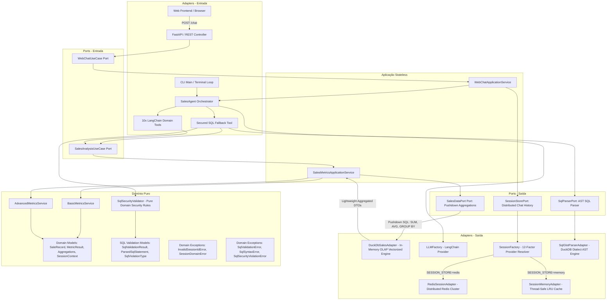
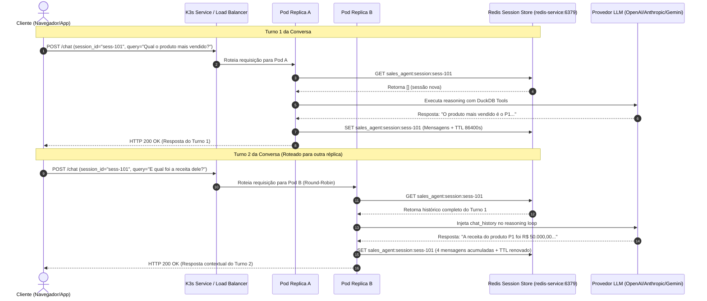

# 🚀 Sales Data Analysis Agent

> **Agente de Inteligência Artificial para Análise Conversacional de Dados de Vendas com Arquitetura Hexagonal, DuckDB e LangChain.**

[](https://github.com/juliosilvacwb/sales-agent)
[](https://hub.docker.com/r/juliosilvacwb/sales-agent)

---

## 📌 Visão Geral

O **Sales Data Analysis Agent** é uma solução de engenharia de IA projetada para democratizar o acesso e a análise de dados tabulares de vendas (`sales.csv`). Usuários e executivos podem realizar consultas analíticas e estratégicas em linguagem natural através de uma interface interativa no terminal (CLI) ou contêiner Docker.

### 🌟 Diferenciais de Arquitetura & Engenharia

1. **Abordagem Híbrida Inteligente:**
   - **10 Domain Tools Determinísticas:** Métricas críticas de negócio (ex: produto mais vendido, SLA logístico, impacto de promoções, déficit de receita, elasticidade) utilizam pushdown de agregação SQL no DuckDB e formatação pura de domínio, imunes a alucinações matemáticas de LLMs.
   - **Secured SQL Fallback Tool com AST Parsing (`sqlglot`):** Perguntas analíticas *ad-hoc* não previstas no catálogo de domínio são roteadas para uma ferramenta de consulta SQL com validação gramatical via Árvore de Sintaxe Abstrata (AST), eliminando falsos positivos em literais de texto e bloqueando mutações em qualquer profundidade da árvore sintática.
2. **Interface Web Premium (FastAPI + Vanilla JS):** Acesso democratizado aos dados de vendas através de um frontend moderno (Dark Mode, layout responsivo) comunicando-se com a API REST de forma assíncrona, eliminando a dependência da CLI.
3. **DuckDB In-Process (OLAP Pushdown Aggregations):** Mecanismo colunar vetorizado para processamento analítico de sub-segundo em memória. Cálculos matemáticos (`SUM`, `AVG`, `FILTER`, `GROUP BY`) são executados nativamente via SQL no C++ do DuckDB, mantendo consumo de memória O(1) e eliminando riscos de Out-of-Memory (OOM) para datasets com 50M+ registros.
4. **Arquitetura Hexagonal (Ports & Adapters):** O núcleo de domínio (regras matemáticas e modelos de dados) possui zero acoplamento com LangChain, DuckDB ou bibliotecas web.
5. **LLM Agnóstico:** Suporte plug-and-play para múltiplos provedores (OpenAI, Anthropic, Google Gemini) via variáveis de ambiente (`.env`).
6. **Observabilidade & Descoberta:** Emissão automática de logs com a tag `[MISSING_TOOL]` quando o fallback SQL é acionado, facilitando a identificação contínua de novas métricas a serem promovidas a Domain Tools.
7. **Segurança Corporativa & AST Guardrails:** Bloqueio determinístico de comandos DML/DDL (`DROP`, `DELETE`, `UPDATE`, `INSERT`, `ATTACH`, `COPY`, etc.) e funções do sistema de arquivos (`read_csv`, `read_text`, `glob`) via inspeção recursiva de AST com `sqlglot`, isolamento de acesso a arquivos externos no DuckDB (`enable_external_access = false`), sanitização contra injeção de HTML/JS no frontend (`DOMPurify`), e redação de paths internos `[REDACTED_PATH]`.
8. **Escalabilidade Distribuída & Sessão Stateless (Redis + K3s):** Camada de computação 100% desacoplada de estado conversacional através da porta de saída `SessionStorePort` e `SessionFactory`, permitindo escalabilidade horizontal em Kubernetes/K3s com multi-réplicas sem perda de histórico conversacional entre pods ou durante rolling updates.

---

## 🏛️ Arquitetura do Sistema

O projeto adota o padrão **Hexagonal (Ports & Adapters)** com **Pushdown Analítico OLAP** e **Sessão Distribuída Stateless** para garantir testabilidade máxima, desacoplamento e escalabilidade enterprise:



### 🔄 Fluxo de Sessão Distribuída Multi-Pod (Stateless Execution)



---

## 🛠️ Catálogo de Ferramentas de Domínio (Domain Tools)

| Ferramenta | Identificador | Descrição de Negócio |
| --- | --- | --- |
| **Top Produto** | `get_top_selling_product` | Identifica o produto líder em volume e receita gerada. |
| **Top Localidades** | `get_top_locations_by_volume` | Lista as localidades/armazéns com maior volume expedido. |
| **Total de Vendas** | `get_total_sales_in_period` | Calcula quantidade total, receita e ticket médio no período. |
| **Realizado vs Planejado** | `compare_planned_vs_actual_quantity` | Compara volume orçado vs executado e percentual de atingimento. |
| **Impacto de Promoções** | `analyze_promotion_impact` | Mensura lift de volume e desconto médio concedido em campanhas. |
| **Gargalos de SLA** | `analyze_service_level_bottlenecks` | Detecta a localidade com pior nível de serviço logístico. |
| **Déficit de Receita** | `calculate_revenue_deficit` | Calcula a perda financeira estimada por desvios de meta. |
| **Desconto Médio** | `calculate_average_discount` | Avalia a margem de desconto médio aplicado frente ao planejado. |
| **Sazonalidade de Vendas** | `identify_sales_seasonality` | Aponta meses de pico, vale e curva de sazonalidade temporal. |
| **Elasticidade de Preço** | `calculate_price_elasticity` | Calcula o coeficiente de elasticidade-preço da demanda. |
| **Fallback SQL Seguro** | `secured_sql_query` | Executa consultas analíticas `SELECT` ad-hoc com validação AST via `sqlglot` e log `[MISSING_TOOL]`. |

---

## 📁 Estrutura de Pastas

```text
challenge_ai_engineer/
├── dataset/
│   └── sales.csv                  # Dataset analítico tabular
├── docs/
│   ├── api/                       # Contratos de API REST (web-chat.md)
│   ├── business-requirements/     # PRDs e requisitos funcionais (R001 a R005)
│   ├── architecture/              # Especificações técnicas e checklists (T001 a T005)
│   ├── security/                  # Auditorias de AppSec e relatórios (S001 a S005)
│   ├── tests/                     # Especificações de cobertura de testes (TEST001 a TEST005)
│   └── quality/                   # Relatórios de validação de qualidade (Q001 a Q005)
├── k8s/                           # Manifestos declarativos Kubernetes / K3s (Stateless Architecture)
│   ├── app-deployment.yaml        # Multi-replica Sales Agent Deployment (2 replicas, probes, limits)
│   ├── app-service.yaml           # ClusterIP Service com balanceamento de carga para a API
│   ├── configmap.yaml             # ConfigMap de ambiente (SESSION_STORE, REDIS_URL, TTL)
│   ├── redis-deployment.yaml      # Deployment do Redis backing service
│   └── redis-service.yaml         # ClusterIP Service interno para o Redis (porta 6379)
├── src/
│   ├── domain/                    # DOMÍNIO PURO (Zero frameworks)
│   │   ├── exception/             # SessionDomainError, SqlValidationError, SqlSyntaxError, SqlSecurityViolationError
│   │   ├── model/                 # SaleRecord, MetricResult, AggregationModels, SessionContext, SqlValidationResult
│   │   └── service/               # BasicMetricsService, AdvancedMetricsService, SqlSecurityValidator
│   ├── application/               # CASOS DE USO E CONTRATOS
│   │   ├── dto/                   # ChatRequestDTO, ChatResponseDTO
│   │   ├── port/
│   │   │   ├── inbound/           # SalesAnalysisUseCase, WebChatUseCase
│   │   │   └── outbound/          # SalesDataPort, SessionStorePort, SqlParserPort (AST Parser)
│   │   └── service/               # SalesMetricsApplicationService, WebChatApplicationService
│   └── adapter/                   # ADAPTERS (Tecnologias externas)
│       ├── inbound/
│       │   ├── cli/               # main.py (Interface terminal)
│       │   ├── web/               # chat_controller.py, static/ (HTML, CSS, JS)
│       │   └── llm/               # sales_agent.py, domain_tools.py, sql_fallback_tool.py (Secured AST Tool)
│       └── outbound/
│           ├── llm/               # llm_factory.py (OpenAI / Anthropic / Gemini)
│           ├── memory/            # session_memory_adapter.py (Thread-safe LRU Cache)
│           ├── parser/            # sqlglot_parser_adapter.py (DuckDB AST Parser via sqlglot)
│           ├── redis/             # redis_session_adapter.py (Cluster Redis com TTL)
│           ├── session_factory.py # 12-Factor Provider Resolver (memory vs redis)
│           └── persistence/       # duckdb_sales_adapter.py (DuckDB Pushdown OLAP)
├── tests/
│   ├── unit/                      # Testes unitários de domínio, portas e adapters (100% isolamento)
│   └── integration/               # Testes de integração End-to-End, AST validation, multi-pod
├── .env.example                   # Modelo de variáveis de ambiente
├── Dockerfile                     # Empacotamento Docker da aplicação
├── pyproject.toml                 # Configurações do Pytest e Linters
└── requirements.txt               # Dependências do projeto (incluindo redis>=5.0.0 e sqlglot>=26.0.0)
```

---

## 🚀 Como Executar

### Pré-requisitos

- Python 3.10+ instalado
- Chave de API de um provedor de IA (OpenAI, Anthropic ou Google Gemini)
- *(Opcional para modo distribuído)* Redis 7+ ou cluster Kubernetes/K3s

### Clonar o Repositório

```bash
git clone https://github.com/juliosilvacwb/sales-agent.git
cd sales-agent
```

### Configuração do Ambiente (.env)

Copie o arquivo de exemplo e defina suas credenciais:

```bash
cp .env.example .env
```

Edite o `.env` conforme o provedor e modo de sessão desejado:

```env
# Provedor de IA (Exemplo com OpenAI)
LLM_PROVIDER=openai
MODEL_NAME=gpt-4o-mini
OPENAI_API_KEY=sk-...

# Exemplo com Anthropic
# LLM_PROVIDER=anthropic
# MODEL_NAME=claude-3-5-sonnet-20241022
# ANTHROPIC_API_KEY=sk-ant-...

# Exemplo com Google Gemini
# LLM_PROVIDER=google
# MODEL_NAME=gemini-1.5-pro
# GOOGLE_API_KEY=AIzaSy...

DATASET_PATH=dataset/sales.csv
LOG_LEVEL=INFO

# Persistência de Sessão Conversacional (Stateless Architecture)
# 'memory': Armazenamento local com cache LRU (ideal para dev local)
# 'redis': Armazenamento centralizado distribuído (produção / multi-pod)
SESSION_STORE=memory
REDIS_URL=redis://localhost:6379/0
SESSION_TTL_SECONDS=86400
```

---

### Execução Local (CLI)

Instale as dependências:

```bash
python -m pip install -r requirements.txt
```

Inicie o agente interativo:

```bash
python -m src.adapter.inbound.cli.main
```

---

### Execução Local (Web Interface)

Inicie o servidor FastAPI:

```bash
python -m uvicorn src.adapter.inbound.web.main:app --reload
```

Acesse a interface web abrindo o navegador em: `http://localhost:8000/`

A documentação da API (Swagger UI) está disponível em: `http://localhost:8000/docs`

---

### 🐳 Execução via Docker & Docker Hub

A imagem pré-construída da aplicação está disponível publicamente no Docker Hub em:
👉 **[juliosilvacwb/sales-agent no Docker Hub](https://hub.docker.com/r/juliosilvacwb/sales-agent)**

#### 1. Executar Imagem Pública (Recomendado)

##### 🌐 Modo Web API (Padrão - FastAPI na porta 8000)

```bash
# Executa a aplicação Web em background mapeando a porta 8000
docker run -d \
  --name sales-agent-web \
  -p 8000:8000 \
  --env-file .env \
  juliosilvacwb/sales-agent:latest
```

> Acesse a interface web em `http://localhost:8000/` e a documentação Swagger em `http://localhost:8000/docs`.

##### 💻 Modo CLI (Terminal Interativo)

```bash
# Executa a interface de linha de comando no terminal
docker run -it --rm \
  --env-file .env \
  --entrypoint python \
  juliosilvacwb/sales-agent:latest -m src.adapter.inbound.cli.main
```

---

#### 2. Passando Variáveis de Ambiente Diretas no Comando (sem arquivo .env)

##### 🌐 Modo Web API via Variáveis Diretas (FastAPI + Porta 8000)

```bash
docker run -d \
  --name sales-agent-web \
  -p 8000:8000 \
  -e LLM_PROVIDER=openai \
  -e MODEL_NAME=gpt-4o-mini \
  -e TEMPERATURE=0.0 \
  -e OPENAI_API_KEY="sk-proj-sua-chave-api-aqui" \
  -e DATASET_PATH=/app/dataset/sales.csv \
  -e LOG_LEVEL=INFO \
  juliosilvacwb/sales-agent:latest
```

##### 💻 Modo CLI via Variáveis Diretas (Terminal Interativo)

```bash
docker run -it --rm \
  -e LLM_PROVIDER=openai \
  -e MODEL_NAME=gpt-4o-mini \
  -e TEMPERATURE=0.0 \
  -e OPENAI_API_KEY="sk-proj-sua-chave-api-aqui" \
  -e DATASET_PATH=/app/dataset/sales.csv \
  -e LOG_LEVEL=INFO \
  --entrypoint python \
  juliosilvacwb/sales-agent:latest -m src.adapter.inbound.cli.main
```

---

#### 3. Build, Tag e Push Local (Para Desenvolvedores)

Caso queira construir e publicar sua própria versão:

```bash
# 1. Construir a imagem Docker localmente
docker build -t sales-agent:latest .

# 2. Marcar a imagem com seu usuário no Docker Hub
docker tag sales-agent:latest juliosilvacwb/sales-agent:latest

# 3. Publicar a imagem no Docker Hub
docker push juliosilvacwb/sales-agent:latest
```

---

## ☸️ Orquestração Kubernetes / K3s (Alta Disponibilidade & Stateless)

O projeto inclui manifestos declarativos prontos para produção na pasta `k8s/`, implantando uma topologia em cluster com:

- **Redis Backing Service:** Deployment com probes de liveness (TCP 6379) e readiness (`redis-cli ping`), além de um `ClusterIP` Service interno (`redis-service:6379`).
- **Sales Agent Web API Multi-Réplica:** Deployment configurado com `replicas: 2`, injeção de configuração via `ConfigMap`, segredos via `SecretKeyRef`, probes HTTP (`/`), e limites rigorosos de recursos (CPU e Memória).
- **Load Balancer Service:** ClusterIP Service (`sales-agent-service:8000`) balanceando as requisições de forma intercambiável entre os pods da aplicação.

### 1. Criar o Secret com a Chave de API

```bash
kubectl create secret generic sales-agent-secrets \
  --from-literal=openai-api-key="sk-proj-sua-chave-api-aqui"
```

### 2. Aplicar os Manifestos K3s

```bash
# Aplica todos os recursos (ConfigMap, Redis Deployment/Service, App Deployment/Service)
kubectl apply -f k8s/
```

### 3. Verificar o Status dos Pods e Serviços

```bash
kubectl get pods -l app=sales-agent
kubectl get pods -l app=redis
kubectl get svc
```

### 4. Acessar a Aplicação no Cluster (Port-Forward Local)

```bash
kubectl port-forward svc/sales-agent-service 8000:8000
```

> Abra o navegador em `http://localhost:8000/` para interagir com a interface web balanceada entre as réplicas.

---

## 🧪 Executando os Testes

O projeto possui uma suíte completa de testes automatizados unitários e de integração:

### Executar Todos os Testes

```bash
python -m pytest
```

### Executar Apenas os Testes Unitários

```bash
python -m pytest tests/unit
```

### Executar Apenas os Testes de Integração End-to-End

```bash
python -m pytest tests/integration
```

---

## 🔒 Segurança e Observabilidade

- **Prevenção de Injeção SQL & AST Guardrails:** A ferramenta `secured_sql_query` analisa consultas estruturalmente via Árvore de Sintaxe Abstrata (`sqlglot`) no dialeto DuckDB. Operações DDL/DML (`DROP`, `DELETE`, `UPDATE`, `INSERT`, `ALTER`, `CREATE`, `REPLACE`, `TRUNCATE`, `PRAGMA`, `ATTACH`, `DETACH`, `COPY`, `LOAD`, `INSTALL`, `COMMAND`) e funções de leitura do sistema de arquivos (`read_csv`, `read_text`, `read_blob`, `read_parquet`, `read_json`, `glob`) são rejeitadas determinística e recursivamente, mesmo quando aninhadas em subconsultas ou CTEs.
- **Eliminação de Falsos Positivos:** Termos proibidos que ocorram exclusivamente dentro de constantes literais de texto (ex: `WHERE product_id = 'DROP_01'`) são preservados como nós `Literal`, eliminando os falsos positivos de validações regex tradicionais.
- **Mitigação de Stacked Queries:** Rejeição automática de consultas encadeadas (`statement_count > 1`) antes de qualquer execução no banco de dados.
- **Sanitização de Respostas e Observabilidade:** Mascaramento de caminhos absolutos do host em mensagens de erro (`[REDACTED_PATH]`), orientação estruturada de autocorreção em erros de sintaxe (`SqlSyntaxError`), truncamento seguro de grandes volumes (`MAX_RESULTS = 50`) e emissão do log de telemetria `[MISSING_TOOL]` para evolução contínua do catálogo de Domain Tools.
