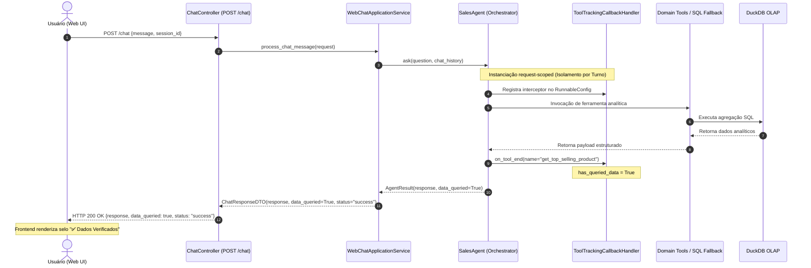

# Referência da API: Interface de Web Chat

Este documento especifica os contratos da API REST para a interface de Web Chat do Agente de Análise de Dados de Vendas, incluindo o fluxo de segurança com autenticação assimétrica JWT.

## URL Base

- **Desenvolvimento Local:** `http://localhost:8000`
- **Cluster Kubernetes / K3s:** `http://sales-agent-service:8000`

---

## `GET /`

Redireciona o usuário para a página da interface de Web Chat.

- **Código de Status:** `307 Temporary Redirect`
- **Location:** `/static/index.html`

---

## `POST /chat`

Processa a mensagem em linguagem natural enviada pelo usuário, mantém o contexto da sessão e retorna a resposta gerada pelo agente analítico.

### Cabeçalhos da Requisição

| Cabeçalho | Obrigatório | Exemplo | Descrição |
| --- | --- | --- | --- |
| `Content-Type` | **Sim** | `application/json` | Tipo do conteúdo do payload. |
| `Authorization` | Condicional* | `Bearer eyJhbGciOiJSUzI1Ni...` | Token JWT RS256 emitido pelo Auth Service (*Obrigatório quando `AUTH_ENABLED=true`). |

> [!NOTE]
> Quando `AUTH_ENABLED=false` (padrão em desenvolvimento local), o guard de segurança é ignorado automaticamente, permitindo requisições sem cabeçalho `Authorization` com identidade `anonymous_dev`.

### Corpo da Requisição (JSON)

**Objeto de Transferência de Dados:** `ChatRequestDTO`

| Campo | Tipo | Obrigatório | Restrições | Descrição |
| --- | --- | --- | --- | --- |
| `message` | string | **Sim** | `min_length: 1`, `max_length: 4000` | A mensagem ou pergunta do usuário. |
| `session_id` | string | **Sim** | `min_length: 1`, `max_length: 128`, regex: `^[a-zA-Z0-9_\-]+$` | O identificador único de sessão usado para manter o histórico conversacional. |

**Exemplo de Requisição:**

```json
{
  "message": "Quais são os 3 produtos mais vendidos?",
  "session_id": "893c5922-4933-40f4-8a58-693df92d47d4"
}
```

### Corpo da Resposta (JSON)

**Objeto de Transferência de Dados:** `ChatResponseDTO`

| Campo | Tipo | Descrição |
| --- | --- | --- |
| `response` | string | A resposta em texto do agente, podendo incluir formatação Markdown. |
| `data_queried` | boolean | Flag determinística indicando se ferramentas de dados (Domain Tools ou SQL Fallback) foram executadas durante o turno (`true` para consultas factuais de banco de dados, `false` para diálogos casuais ou erros). |
| `status` | string | Status da resposta (`"success"` ou `"error"`). |

**Exemplo de Resposta (Consulta Analítica Fact-Grounded - 200 OK):**

```json
{
  "response": "Os 3 produtos mais vendidos são:\n\n1. Produto A\n2. Produto B\n3. Produto C",
  "data_queried": true,
  "status": "success"
}
```

**Exemplo de Resposta (Diálogo Casual / Greeting - 200 OK):**

```json
{
  "response": "Olá! Sou seu assistente de análise de dados de vendas. Como posso te ajudar hoje?",
  "data_queried": false,
  "status": "success"
}
```

---

### Mecanismo de Grounding e Selo "Dados Verificados" (T013 / R013)

O sistema implementa rastreamento determinístico em tempo real via interceptação de callbacks LangChain (`ToolTrackingCallbackHandler`) com isolamento estrito por requisição:

1. **Ativação Determinística (`data_queried: true`):** Acionada quando ao menos uma ferramenta analítica de domínio (`get_top_selling_product`, `get_total_sales_in_period`, etc.) ou a ferramenta de fallback SQL seguro (`secured_sql_query`) for executada com sucesso durante o turno.
2. **Omissão Segura (`data_queried: false`):** Mantida para cumprimentos, esclarecimentos gerais, rejeições de política ou falhas de execução.
3. **Renderização no Frontend:** O Web Chat (`app.js`) insere dinamicamente o badge acessível `✅ Dados Verificados` (`role="status"`, `aria-label="Dados verificados no banco de dados"`) abaixo da bolha de mensagem do assistente quando `data_queried === true`.



### Respostas de Erro de Autenticação & Validação

**401 Unauthorized (Token Ausente ou Inválido):**

*Retornado quando o token não é fornecido, está expirado ou possui assinatura inválida. O cabeçalho `WWW-Authenticate: Bearer` é incluído na resposta.*

```json
{
  "detail": "Token ausente ou cabeçalho inválido"
}
```

ou

```json
{
  "detail": "Token inválido ou expirado"
}
```

**422 Unprocessable Entity (Erro de Validação de Payload):**

```json
{
  "detail": [
    {
      "loc": ["body", "message"],
      "msg": "ensure this value has at most 4000 characters",
      "type": "value_error.any_str.max_length"
    }
  ]
}
```

---

## `GET /health`

Health check endpoint para sondas de liveness e readiness do Kubernetes e Docker Compose. É uma rota pública e **não** exige cabeçalho de autenticação.

### Resposta de Sucesso (200 OK)

```json
{
  "status": "ok"
}
```

---

## Cabeçalhos & Segurança

- **Autenticação:** Inbound Guard `verify_jwt_token` validando assinaturas com a chave pública RSA do Auth Service.
- **CORS:** Controlado via variável de ambiente `ALLOWED_ORIGINS`.
- **Cabeçalhos de Proteção:** As respostas incluem `X-Content-Type-Options: nosniff`, `X-Frame-Options: DENY` e `Referrer-Policy: strict-origin-when-cross-origin`.
- **Sanitização XSS:** O frontend higieniza o Markdown recebido utilizando `DOMPurify` antes da renderização no DOM.

---

## Gerenciamento de Sessão Distribuída (Stateless Architecture)

A persistência do histórico conversacional é desacoplada da camada de computação através da porta `SessionStorePort`, suportando dois provedores configuráveis via ambiente:

1. **Redis Distribuído (`SESSION_STORE=redis`):** Armazena as mensagens em um cluster Redis centralizado com namespacing (`sales_agent:session:<session_id>`) e renovação automática de TTL a cada interação (`SESSION_TTL_SECONDS=86400`). Permite escalabilidade horizontal multi-pod com 100% de paridade conversacional entre réplicas.
2. **Memória Local (`SESSION_STORE=memory`):** Fallback thread-safe com descarte LRU (capacidade padrão de 500 sessões) para desenvolvimento local offline e testes unitários.
